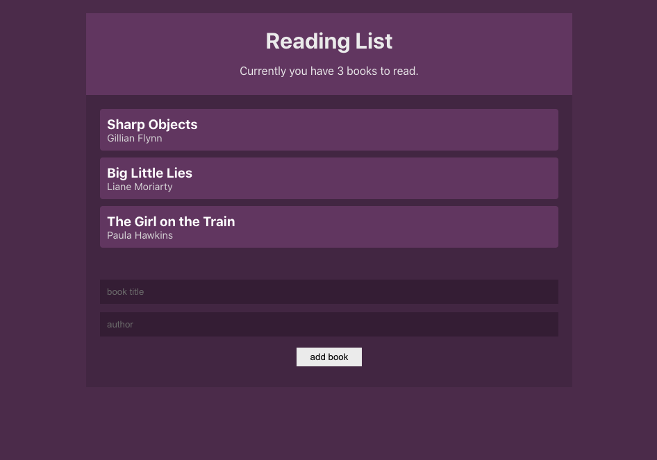

# React Context API Tutorial Project
This project was created following The Net Ninja's [Youtube tutorial](https://www.youtube.com/playlist?list=PL4cUxeGkcC9hNokByJilPg5g9m2APUePI) on React Context & Hooks.

## Lessons Learned 
* Normally, data is passed as props through components, even components that don't need the data
* Contexts are used to share "global" data across multiple child components
* Consume context:
    * contextType - only for class based components, can only use one context
    * Consumer - also works with functional components, can use more than one context per component
    * useContext hook - only for functional components
* Reducers - optional way to consolidate all methods for changing state into a single function: 
    * Reducer function: contains all state manipulation logic
    * Action object: describes the type of change we want to make inside the reducer function
    * Dispatch function: sends the action to the reducer

## Project Features
* Display a list of books with title and author
* Ability to delete a book from the list
* Form to add new books to the list

## Screenshots
